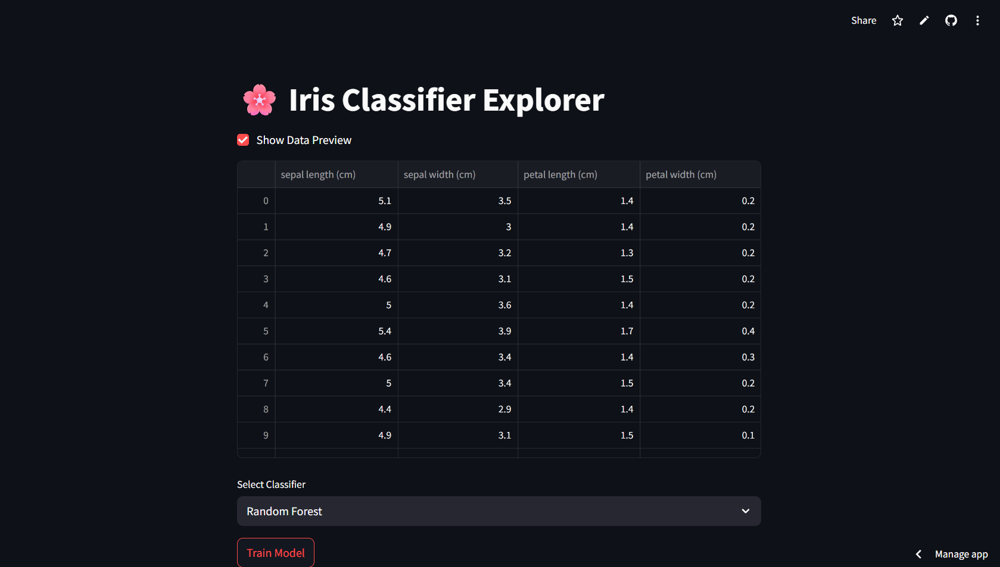

# 🌸 Iris Classifier Explorer

A Streamlit web application that allows you to explore and compare different machine learning classifiers (KNN, SVM, Random Forest) on the famous Iris dataset.

---

## About

This project is an interactive tool built with Streamlit to demonstrate the application of various classification algorithms on the **Iris dataset**. The Iris dataset is a classic in machine learning, comprising measurements of iris flowers (sepal length, sepal width, petal length, petal width) and their corresponding species.

The application allows users to:
* Preview the Iris dataset.
* Select from three popular classification models: K-Nearest Neighbors (KNN), Support Vector Machine (SVM), and Random Forest.
* Train the selected model on a split of the data.
* View the model's accuracy, a confusion matrix, and a detailed classification report.

This tool is perfect for understanding how different classifiers perform on a simple, well-understood dataset and for visualizing their results.

---

## Features

* **Data Preview:** Option to display the raw Iris dataset in a tabular format.
* **Classifier Selection:** Choose between KNN, SVM, and Random Forest classifiers.
* **Model Training:** On-demand training of the selected model.
* **Performance Metrics:** Displays accuracy score for the trained model.
* **Confusion Matrix:** Visualizes the confusion matrix to understand classification performance per class.
* **Classification Report:** Provides a detailed report with precision, recall, f1-score, and support for each class.

---

## Demo

---
## Live Preview
[Click!](https://irisdataset.streamlit.app/)
