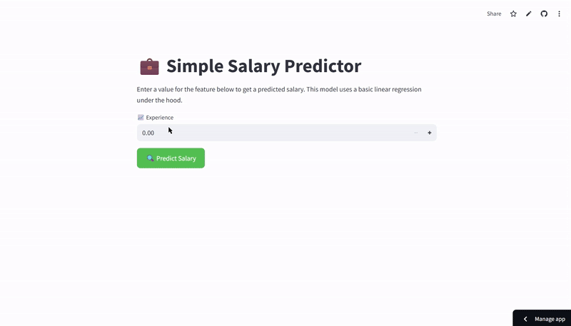

# 💼 Simple Salary Predictor

A Streamlit app that predicts salary based on years of experience using a basic linear regression model.

---

## About

This project is a simple regression problem where the goal is to predict a person's salary given their years of professional experience.  
The model is trained using linear regression and saved as a pickle file (`salary_predictor.pkl`). The Streamlit app provides an easy-to-use interface to input experience and get a predicted salary.

---

## Demo

 

---

## Features

- Simple, clean UI built with Streamlit.
- Input field for years of experience (accepts decimal values).
- Button to predict salary using the trained model.
- Displays predicted salary
---
## Live Demo
https://salary-predictor-model.streamlit.app/
